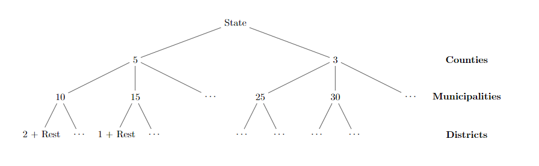

```{r setup, include=FALSE}
library(data.table)
library(recordSwapping)
library(ggplot2)
```

## Overview

This is the vignette for the R-Package *recordSwapping* which can be used to apply the record swapping algorithm to a micro data set.
The implementation of the procedure was done purely in C++ and is based on the SAS code on targeted record swapping from ONS (https://ec.europa.eu/eurostat/cros/content/2-record-swapping_en). 
There are however substantial differences between the SAS- and C++-Code. Some of these differences are the result of improving the run-time for the C++ implementation. In the next section the differences between the 2 implementations are presented further.
. The R-Package is just as a front end to easily call the procedures und for testing purposes.


## Functionality
The targeted record swapping can be applied with the function `recordSwap()`. All other functions in the package are called from inside `recordSwap()` and are only exportet for testing purposes. The function has the following arguments:

```{rcpp,include=TRUE,eval=FALSE}
recordSwap(std::vector< std::vector<int> > data, std::vector<int> similar,
                                           std::vector<int> hierarchy, std::vector<int> risk, int hid, 
                                           int th, double swaprate, int seed = 123456)
```

+ **data** micro data containing ONLY integer values, rectangular table format.
+ **similar** vector containing the similarity profiles that is sets of variables in \code{data} which should be considered when swapping households. 
+ **hierarchy** column indices of variables in \code{data} which refere to the geographic hierarchy in the micro data set. For instance county > municipality > district.
+ **risk** column indices of variables in \code{data} which will be considered for estimating the risk. This is only used if `risk` was not supplied.
+ **hid** column index in \code{data} which refers to the household identifier.
+ **th** integer defining the threshhold of high risk households (k-anonymity). Right now this is implemented as `k_anonymity <= counts`.
+ **swaprate** double between 0 and 1 defining the proportion of households which should be swapped, see details for more explanations
+ **seed** integer defining the seed for the random number generator, for reproducability.

**IMPORTANT**: The argument `data` contains the micro data and can be understood as a vector of vectors. Inside the function, `data` is expected to contain each column of the input data as `std::vector<int>` which are then again stored in an `std::vector< std::vector<int> >`. So `data[0]` addresses the first column and `data[0][0]` the first entry in the first column. 


### Some differences to SAS-Code

#### Riskdefinition

+ **C++-Code**: Risk is calculated using counts over the geographic hierarchies (`hierarchy`) and the combination of all risk variables.
+ **SAS-Code**: Risk is calculated using counts for each geographic hierarchy (`hierarchy`) and risk variable seperately. These risks are then combined to produce a single risk value for each record.

#### Sampling probability

+ **C++-Code**: Sampling probability is directly derived from the counts over the risk and each geographic variables, by 
$$
p_{i,h}=\frac{1}{counts_{i,h}}
$$
where $counts_{i,h}$ is the number of counts for record $i$ in hierarchy $h$. This sampling probability is used for selecting households as well as donor households. 

+ **SAS-Code**: Sampling probability is derived from the multiple factors.
    
$$
p_i = \begin{cases}
0.999 \quad \text{for low risk household} \\
\frac{b\cdot N_{high}}{SA\cdot c-b\cdot c} \quad \text{for }b>0 \\
\frac{0.2\cdot N_{high}}{SA\cdot c-0.2\cdot c} \quad \text{for }b=0 \\
\frac{0.1\cdot N_{high}}{SA\cdot c-0.1\cdot c} \quad \text{for }b<0
\end{cases}
$$
where 
$$
b = SA - N_{high}\\
c = N_{netto} - N_{high}
$$
with $SA$ as the sample size, $N_{high}$ as the number of high risk households in the geographic area and $N_{netto}$ the number of non-imputed records in the geographic area.


#### Swapping Records

+ **C++-Code**: Swaps are made in every hierarchy level and records wich do not fullfill the k-anonymity are swapped. The donor set of records to be swapped with is always made out of every record wich do not belong to the same geographic area as the swapped households. At the lowest hierarchy level an additional number of households is swapped such that the proportion of households swapped is equal the number in `swaprate`. If the proportion of already swapped households succeeds this values then only records wich do not fullfill the k-anonymity are swapped.



Figure 1 displays an example with hierarchy levels county > municipality > district where the number of high risk households are displayed at the end of the edges. For instance in the first county there are 5 high risk households which will be swapped with households from county 2. In the first municipality there are 10 high risk households which will be swapped with households which are not in the first municipality. At the lowest level, the districts, the number of swaps, $n_{swaps}$ is for the first district is defined by

$$
n_{swaps} = 2 + Rest\\
Rest = \max(0,N\cdot s - n_{already}) 
$$
with $N$ as the number of householdsin the district, $n_{already}$ as the number of already swapped households in the district and $s$ as the swap rate. 

+ **SAS-Code** Swaps are made in every hierarchy level and depending on the sampling probability high risk households are more likely to be swapped than low risk households, but they are not mandatorilly swapped. The number of swappes in each hierachy level is defined by the number of high risk records and total number records in the geographic area.
For instance having the geographic hierarchy county > municipality > district, the number of Swaps in the municipality $m$ of county $n$ is defined by

$$
SWAP_m = \frac{SIZE_m+RISK_m}{2}
$$
where $SIZE_m$ can be derived by using the reciprocal number of households of each municipality in county $n$.

$$
SIZE_m = \frac{N_m^{-1}}{\sum_iN_i^{-1}}\cdot sN_n
$$
with $N_m$ as the number of households in municipality $m$, $s$ the global swaprate and $N_n$ as the number of households in county $n$.
$RISK_m$ can be derived using the proportion of of high risk households in each municipality

$$
RISK_m = \frac{H_m}{\sum_iH_i}\cdot sN_n
$$

with $H_m$ as the proportion of high risk households in municipality $m$.

## Application

The package was tested on randomly generated data, which contained 4 geographic levels and some other soziodemographic variables.
```{r}
dat <- recordSwapping:::create.dat(N=250000)
dat
```

Applying the record swapping to dat could look like this

```{r}
hierarchy <- 0:2
risk_variables <- 5:7
k_anonymity <- 3
swaprate <- .05
hid <- 4
similar <- c(5)

dat_swapped <- recordSwap(dat,similar,hierarchy,risk_variables,hid,k_anonymity,swaprate)
dat_swapped
```

Here the procedure was applied to `dat`

+ using every hierarchy level, `nuts1` to `nuts3` 
+ using `hsize` as the similarity variable (so only households with the same household size are swapped)
+ using `hsize`, `ageGroup`, `gender` as risk variables
+ setting the k-anonymity rule to 3
+ setting the swaprate to 0.05

Please note, that in C++ indexing starts with 0 but in R it starts with 1. Therefore the position of columns in `dat` are specified by `5`,`0:2`,ect...

If `th <- 0` only the swaprate is considered. Then at most `th*100`% of the households are swapped. If the sample is very small the actual number of swaps can be smaller, however this can only happen if some regions have a very small number of households e.g. 1,2,3,...

```{r}
k_anonymity <- 0
swaprate <- .05
dat_swapped <- recordSwap(dat,similar,hierarchy,risk_variables,hid,k_anonymity,swaprate)
dat_swapped
```

Comparing number of swapped households

```{r}
dat_compare <- merge(dat[,.(paste(geo=nuts1[1],nuts2[1],nuts3[1],nuts4[1],sep="_")),by=hid],
                     dat_swapped[,.(paste(geo=nuts1[1],nuts2[1],nuts3[1],nuts4[1],sep="_")),by=hid],by="hid")

# number of swapped households
nrow(dat_compare[V1.x!=V1.y])
```
```{r}
# swaprate times number of households in data
swaprate*nrow(dat[!duplicated(hid)])
```

With the parameter `similar` multiple variables for similarity can be supplied to the function

```{r}
# demonstrate on small data set
dat <- recordSwapping:::create.dat(N=10000)
# similarity profile contains:
# hsize + htype + hincome
hierarchy <- 0:1
similar <- c(5,9,10)

# procedure will not always find a suitable donor
dat_swapped <- recordSwap(dat,similar,hierarchy,risk_variables,hid,k_anonymity,swaprate)
dat_compare <- merge(dat[,.(paste(geo=nuts1[1],nuts2[1],nuts3[1],nuts4[1],sep="_")),by=hid],
                     dat_swapped[,.(paste(geo=nuts1[1],nuts2[1],nuts3[1],nuts4[1],sep="_")),by=hid],by="hid")

# number of swapped households
nrow(dat_compare[V1.x!=V1.y])
```

The use of multiple similarity profiles will be implemented for future versions of this package.


## Benchmarking

```{r benchmark, include=FALSE}
load(paste0("../data/benchmark_cpp.RData"))
mb_all <- rbindlist(mb_all)

mb_all<- mb_all[,.(value=median(time/1e9)),by=list(hier.levels,expr,npop)]
mb_all[,Hierarchy.Levels:=factor(hier.levels)]
```

The function applied on randomly generated household data with $n=10^3,10^4,2\cdot 10^4,8\cdot 10^4,1.6\cdot 10^5,3.2\cdot 10^5,5\cdot 10^5,10^6$ households.
The parameter `swaprate` was set to 0.05 and the paramter `th` was set 2. In addition the targeted record swapping was applied using 2, 3 and 4 hierarchy levels.
Using all 4 hierarchy levels results in over 18000 distinct geographic areas.
Figure 2 shows the runtime for different levels of $n$ and different number of geographic hierarchies, using the C++ implementation. Using 1 million households and 4 hierarchy levels the runtime is at roughly `r round(mb_all[hier.levels==4&npop==1000000,value])` Seconds. *Note: Benchmarks were run with the script `RUN_benchmark.R` in tests/testthat/*.

```{r benchmark_plot,echo=FALSE,eval=TRUE,fig.cap="Runtime of procedure for different number of households and hierarchy levels.",fig.align="center",fig.width=7}
p1 <- ggplot(mb_all,aes(npop,value))+
  geom_point(aes(color=Hierarchy.Levels))+
  geom_line(aes(color=Hierarchy.Levels),alpha=0.4)+
  ylab("seconds")+
  xlab("Number of Households")
plot(p1)
```


